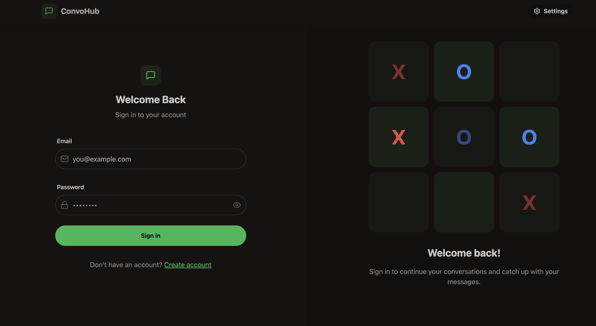

# ✨ Full Stack Realtime Chat App ✨


Welcome to the **Full Stack Realtime Chat App**! This app is built using modern technologies to deliver a seamless and interactive real-time chat experience.

---

## 🚀 Highlights

- 🌟 **Tech Stack**: MERN (MongoDB, Express, React, Node.js) + Socket.io + TailwindCSS + Daisy UI  
- 🎃 **Authentication & Authorization**: Secured with JWT.  
- 👾 **Real-time Messaging**: Powered by Socket.io.  
- 🚦 **Online User Status**: Track users in real-time.  
- 👌 **Global State Management**: Implemented with Zustand for a smooth experience.  
- 🐞 **Robust Error Handling**: Client-side and server-side error management.  
- ⭐ **Deployment**: Deployed for FREE with detailed guidance.  
- ⏳ **More Features**: And much more to explore!  

---

## 📸 Preview



## 🛠️ How to Set Up the Project

Follow these steps to get the app up and running:

### 1️⃣ Clone the Repository

```bash
git clone https://github.com/AnujGahra/ConvoHub-Chat-Application
cd your-repo-name
```

### 2️⃣ Install Node Packages

Navigate to both the `backend` and `frontend` directories to install dependencies:

#### Backend

```bash
cd backend
npm install
```

#### Frontend

```bash
cd frontend
npm install
```

### 3️⃣ Create a `.env` File

In the `backend` directory, create a `.env` file and add the following environment variables:

```env
MONGODB_URI=your_mongodb_connection_string
PORT=8001
JWT_SECRET=your_jwt_secret

CLOUDINARY_CLOUD_NAME=your_cloudinary_cloud_name
CLOUDINARY_API_KEY=your_cloudinary_api_key
CLOUDINARY_API_SECRET=your_cloudinary_api_secret

NODE_ENV=development
```

Make sure to replace the placeholder values (`your_mongodb_connection_string`, `your_jwt_secret`, etc.) with your actual configuration.

### 4️⃣ Run the Backend

Start the backend server from the `backend` directory:

```bash
cd backend
npm run dev
```

### 5️⃣ Run the Frontend

Start the frontend development server from the `frontend` directory:

```bash
cd frontend
npm run dev
```

---

## 🚀 Build for Production

To build the app for production, run the following command in the `frontend` directory:

```bash
npm run build
```

---

## ▶️ Start the App in Production

To start the app in production mode:

#### Backend

```bash
cd backend
npm start
```

#### Frontend

Deploy the contents of the `frontend/build` directory to your preferred hosting platform (e.g., Netlify, Vercel).

---

Enjoy building and using your very own **Realtime Chat App**! 🚀

Let me know if you'd like further additions or refinements! 😊
